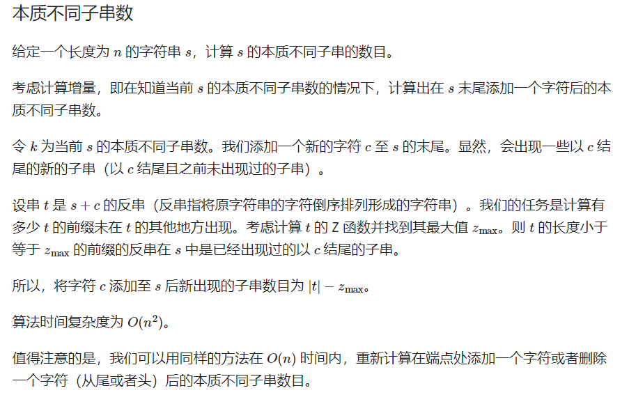

# 字符串

## KMP

```cpp
int nex[N];//next[i]=j,含义是:下标为i 的字符前的字符串最长相等前后缀的长度为j
void get_nex(string &s){
    int j=0,k=-1;
    nex[0]=-1;
    while(j<(int)s.size()){
        if(k==-1 || s[j]==s[k]){
            j++; k++;
            nex[j]=k;
        }else{
            k=nex[k];
        }
    }
}
int KMP(string &s1,string &s2){
    int i=0,j=0;
    get_nex(s2);
    while(i<(int)s1.size() && j<(int)s2.size()){
        if(j==-1 || s1[i]==s2[j]){
            i++,j++;
//            if(j>=(int)s2.size()){
//                ans.push_back( i-(int)s2.size() );
//                j=nex[j];
//            }
        }else{
            j=nex[j];
        }
    }
    if(j>=(int)s2.size()) return i-(int)s2.size();
    return -1;
}
```

最小循环节长度**len - next[len]**
如果能由它循环多次得来，一定满足**len%(len-next[len])==0**
次小的循环节应该是**len - next[next[len]]**，以此类推，当然需要判断一下

### EXKMP

```cpp
int nex[N];//nex[i]表示T[i,T.size()-1]和T的最长公共前缀长度
int ex[N];//ex[i]表示T与S[i,S.size()-1]的最长公共前缀

void getnex(string s){
    int j=0,po;
    int len=(int)s.size();
    nex[0]=len;
    while( j+1<len && s[j]==s[j+1] ) j++;
    nex[1]=j;
    po=1;
    for(int i=2;i<len;i++){
        if( nex[i-po]+i<nex[po]+po ) nex[i]=nex[i-po];
        else{
            j=nex[po]+po-i;
            if(j<0) j=0;
            while( i+j<len && s[j]==s[i+j] ) j++;
            nex[i]=j;
            po=i;
        }
    }
}

void exKMP(string s,string t){
    int j=0,po=0;
    int lens=(int)s.size(),lent=(int)t.size();

    getnex(t);

    while( j<lens && j<lent && s[j]==t[j] ) j++;
    ex[0]=j;

    for(int i=1;i<lens;i++){
        if(nex[i-po]+i<ex[po]+po) ex[i]=nex[i-po];
        else{
            j=ex[po]+po-i;
            if(j<0) j=0;
            while( i+j<lens && j<lent && s[i+j]==t[j] ) j++;
            ex[i]=j;
            po=i;
        }
    }
}
```

### 本质不同的字串数



## 哈希

**时间复杂度(1)的询问子串哈希**


```cpp
const ll mod1 = 1e9+7;
const ll mod2 = 1e9+9;
char s[N];
ll base1[N],base2[N];
ll p_h1[N],p_h2[N];
ll p_h3[N],p_h4[N];//回文

inline ll query( int l,int r,int key ){//O(1) 询问hash值
    if( key ) return ((p_h1[r]-p_h1[l-1]*base1[r-l+1]%mod1)+mod1)%mod1;
    return ((p_h2[r]-p_h2[l-1]*base2[r-l+1]%mod2)+mod2)%mod2;
}

inline ll query2( int l,int r,int key ){//回文
    if( key ) return ((p_h3[r]-p_h3[l-1]*base1[r-l+1]%mod1)+mod1)%mod1;
    return ((p_h4[r]-p_h4[l-1]*base2[r-l+1]%mod2)+mod2)%mod2;
}
inline bool Palindrome( int l,int r ){//回文
    return ( query(l,r,1 )==query2( n-r+1,n-l+1,1 ) && query(l,r,0)==query2( n-r+1,n-l+1,0) );
}

void hash_val(){
    base1[0]=1;  base2[0]=1;
    ll B=13331;
    for(int i=1;i<=n;i++){
        base1[i]=base1[i-1]*B%mod1;
        base2[i]=base2[i-1]*B%mod2;
    }
    for(int i=1;i<=n;i++){
        p_h1[i]=( p_h1[i-1]*B + s[i] )%mod1;
        p_h2[i]=( p_h2[i-1]*B + s[i] )%mod2;
        
        //回文
        p_h3[i]=( p_h3[i-1]*B + s[n-i+1] )%mod1;
        p_h4[i]=( p_h4[i-1]*B + s[n-i+1] )%mod2;
    }
}
```

**枚举对称轴**

```cpp
//特判字串len=1

//枚举长度为偶数的对称轴,tem=len/2;
for(int i=1;i<n;i++){
    if( s[i]!=s[i+1] ) continue;
    int l=1,r=min( i,n-i ),tem;
    while(l<=r){
        int mid=(l+r)/2;
        if( check( i-mid+1,i+mid ) ){
            tem=mid;
            l=mid+1;
        }else{
            r=mid-1;
        }
    }
    //
}

//枚举长度为>=3的奇数的对称轴，tem=(len-1)/2;
for(int i=2;i<=n-1;i++){
    if( s[i-1]!=s[i+1] ) continue;
    int l=1,r=min( i-1,n-i ),tem;
    while(l<=r){
        int mid=(l+r)/2;
        if( check( i-mid,i+mid ) ){
            tem=mid;
            l=mid+1;
        }else{
            r=mid-1;
        }
    }
    //
}
```

## 字典树

```cpp
int nex[100000][26], cnt;
bool exist[100000];  // 该结点结尾的字符串是否存在

void insert(char *s, int len) {  // 插入字符串
    int p = 0,c;
    for (int i = 0; i < len; i++) {
        c = s[i] - 'a';
        if (!nex[p][c]) nex[p][c] = ++cnt;  // 如果没有，就添加结点
        p = nex[p][c];
    }
    exist[p] = 1;
}
bool find(char *s, int len) {  // 查找字符串
    int p = 0,c;
    for (int i = 0; i < len; i++) {
        c = s[i] - 'a';
        if (!nex[p][c]) return 0;
        p = nex[p][c];
    }
    return exist[p];
}
```

## 马拉车算法

```cpp
string Manacher(string &s){
    string t="@#";
    for(int i=0;i<s.size();i++){
        t+=s[i];   t+="#";
    }

    vector<int> p(t.size(),0);
    int mx=0,id=0,resLen=0,resCenter=0;
    for(int i=1;i<t.size();i++){
        p[i]=mx>i?min(p[2*id-i],mx-i):1;
        while( t[i+p[i]]==t[i-p[i]] ) ++p[i];
        if(mx<i+p[i]){
            mx=i+p[i];
            id=i;
        }
        if(resLen<p[i]){
            resLen=p[i];
            resCenter=i;
        }
    }
    return s.substr( (resCenter-resLen)/2,resLen-1 );
}
```

## 后缀数组

```cpp
int n,m;
char s[N];
int y[N],x[N],c[N],sa[N],rk[N],height[N];

//sa[i]:排名为i的后缀的位置
//rk[i]:从第i个位置开始的后缀的排名,下文为了叙述方便,把从第i个位置开始的后缀简称为后缀i
void get_sa(){
    for(int i=1;i<=n;i++) ++c[ x[i]=s[i] ];

    for(int i=2;i<=m;i++) c[i]+=c[i-1];
    for(int i=n;i>=1;i--) sa[ c[ x[i] ]-- ]=i;
    for(int k=1;k<=n;k<<=1){
        int num=0;
        for(int i=n-k+1;i<=n;i++) y[++num]=i;
        for(int i=1;i<=n;i++) if(sa[i]>k) y[++num]=sa[i]-k;
        for(int i=1;i<=m;i++) c[i]=0;
        for(int i=1;i<=n;i++) ++c[ x[i] ];
        for(int i=2;i<=m;i++) c[i]+=c[i-1];
        for(int i=n;i>=1;i--) sa[ c[ x[ y[i] ] ]-- ]=y[i],y[i]=0;
        swap(x,y);
        x[ sa[1] ]=1;
        num=1;
        for(int i=2;i<=n;i++){
            x[sa[i]]=(y[sa[i]]==y[sa[i-1]] && y[sa[i]+k]==y[sa[i-1]+k]) ? num : ++num;
        }
        if(num==n) break;
        m=num;
    }
    for (int i=1;i<=n;i++) rk[sa[i]]=i;
}

void get_height() {
	for (int i=1,j,k=0;i<=n;i++) {
		if (rk[i]==1) continue;
		if (k) --k;
		j=sa[rk[i]-1];
		while (j+k<=n && i+k<=n && s[i+k]==s[j+k]) ++k;
		height[rk[i]]=k;
	}
}

int main(){
        cin>>(s+1);
        n=strlen(s+1); m='z';//m为s中的最大字符ascll码
        get_sa();
        for(int i=1;i<=n;i++){
            cout<<sa[i]<<" ";
        }
	    return 0;
}
```

